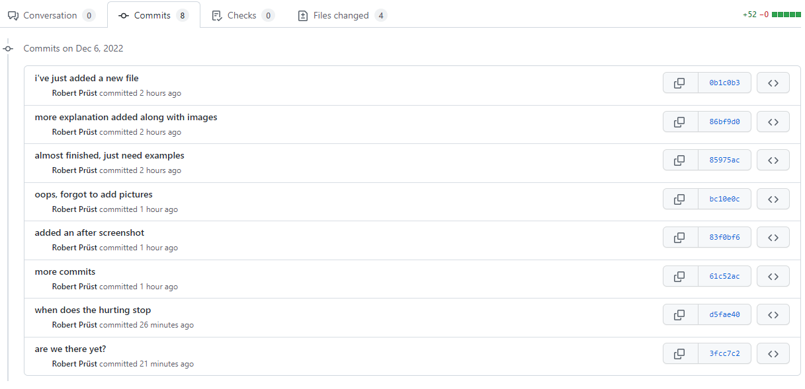

# Git squashing

Working with git can create quite the commit history.  
If you want to clean up some of the history (mostly the `woops, typo` and `another commit` messages that are of no use), you might want to look into squashing your commits.

You can do this in one of 2 ways:

1. Squashing in your current branch
1. Squashing on a merge into a new branch

## Why would you choose one over another?  

Squashing in your current branch allows you to clean up your current branch without having to merge with another branch.  
This can also hel if you do want to merge into another branch but you want to clean up your commits before you merge (for example removing all the trivial `fixing a typo` commits).  
This can change your commit history from this:  

To this:

Using the squashing on a merge option, a completely merged branch will look as if it was simply a single commit on the branch you're merging on.  
So for example you want to merge `feature1` onto `main`, the merge will look like a commit on `main`, not actually branching out to/from `feature1`.

## Squashing in your current branch

Squashing in your current branch can be done through the use of the `git rebase` command.  
Now don't immediately start ramming your keyboard and executing this, there's some nuance to this, as [rebase](https://git-scm.com/docs/git-rebase) is a rather powerfull (and destructive) command if you use it incorrectly.

The rebase command rewrites/deletes history through a new commit and removing previous commits on the way.  
How to use it is as follows:

`git rebase -i <commit to look back at>`

for example

`git rebase -i HEAD~3`

which means HEAD (current location) + 2 commits back (the last 3 commits)

`git rebase -i c2d0fd3`

which means all the commits from now (HEAD) untill **c2d0fd3**.  
Tip: you can find your commits by using `git log --oneline`

### Example

Let's take `git rebase -i c2d0fd3` as an example

This will start the **rebase** in [**interactive**](https://git-scm.com/docs/git-rebase#Documentation/git-rebase.txt---interactive) mode and takes the last commits since **c2d0fd3** and will let you define what to do with them.

It will open your favourite editor with a `/.git/rebase-merge/git-rebase-todo` file which you need to manually edit and say what you want to squash (or take other actions on).  

It includes more information on what the options are, but we'll narrow it down to what is needed for the squash: `squash` or `s`.

Leave the commit you want latest on `pick` (take into account that this means the files, not the commit message, you can change this later).

Set all the commits which you want to squash to `squash`, leave the rest of the commits as they are (`pick`) and save and close the file.

It will then open your favourite editor with a `/.git/COMMIT_EDITMSG` file in which you need to define what commit messages you want to include on your latest commit.  
Do note that you by default it will leave all commit history messages available in your latest commit, but you can edit it here to either include all messages, parts or nothing at all.  

The easiest thing to do is to comment everything out that you don't want with a `#` and leave what you want to be the commit message uncommented.

Save and close this file and presto chango, git will rebase with your input and history has been rewritten!

## Squashing on a merge into a new branch

Now this is the "easiest" of the 2 options and will be the most commonly used if everything is done right.  
Most of the time you will have a `main` branch which will be locked/protected from merging, thus requiring a `Pull Request` before changes onto it can be merged.  
Once you want to Complete the Pull Request, you can choose what kind of merge you want to apply.

In this situation you want to look at the Squash Merge option.  

### Azure DevOps

In Azure DevOps this can be easily done through the "Complete pull request" wizard, [selecting the correct Merge type](https://learn.microsoft.com/en-us/azure/devops/repos/git/merging-with-squash?view=azure-devops#complete-pull-requests-with-squash-merge)

### GitHub

In GitHub this can be done by selecting the dropdown option on `Merge pull request` and selecting `Squash and merge` when you're ready to merge your Pull Request.

If you don't have the option directly available in GitHub, this might be restricted by the repository owner. You can configure the option as described [here](https://docs.github.com/en/repositories/configuring-branches-and-merges-in-your-repository/configuring-pull-request-merges/configuring-commit-squashing-for-pull-requests).